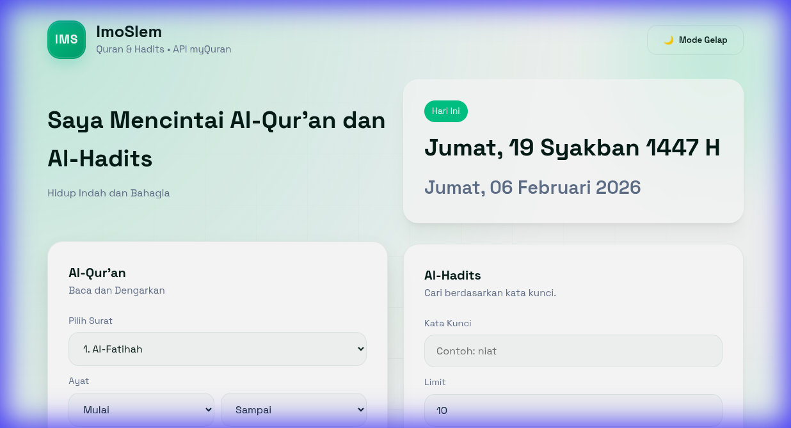
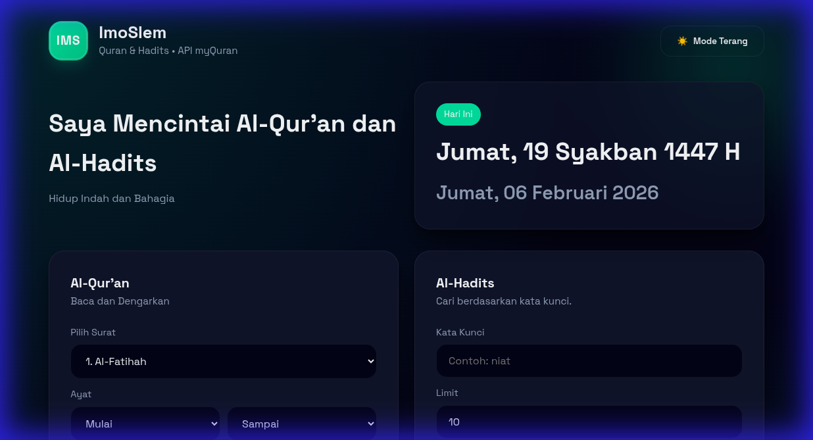
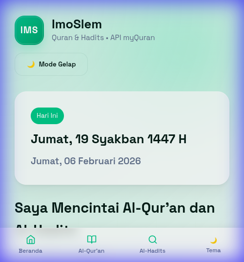
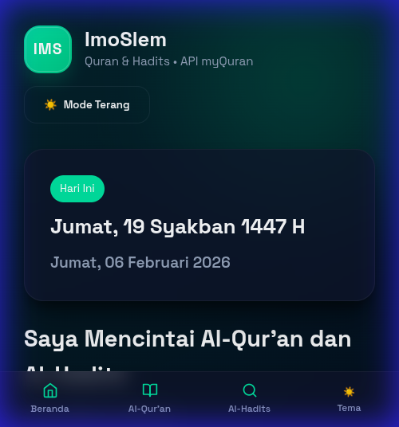

# ImoSlem

Web responsif bernuansa hijau tua dengan mode terang/gelap untuk membaca dan mendengarkan Al-Qur'an serta pencarian Al-Hadits. Data diambil dari `https://api.myquran.com/v3/`.

## Preview

### Desktop View

  
  

### Mobile View

  
  

## Fitur
- [Baru] **Mobile Bottom Navigation**: Navigasi cepat khusus HP dengan desain *Glassmorphism*.
- [Baru] **PWA (Progressive Web App)**: Bisa diinstal di HP dan mendukung caching via Service Worker.
- Pencarian ayat berdasarkan surat dan rentang ayat (Mulai–Sampai).
- Tombol "Baca Semua" untuk memuat seluruh ayat dalam satu surat secara otomatis.
- Teks Arab, terjemahan, dan audio per ayat.
- Auto‑advance audio: lanjut ke ayat berikutnya saat audio selesai.
- Pencarian Al‑Hadits dengan pagination dan detail teks Arab + terjemahan.
- Tanggal Hijriyah dan Masehi hari ini.
- Tema gelap/terang (Sinkron desktop & mobile).

## Struktur File
- `index.html`: Struktur utama dan UI.
- `styles.css`: Desain modern dengan CSS Variables & Glassmorphism.
- `app.js`: Logika interaksi API dan state management.
- `sw.js` & `manifest.json`: Konfigurasi PWA.

## Cara Menjalankan
Buka `index.html` langsung di browser.

## Deploy ke GitHub Pages
1. Push repository ke GitHub.
2. Buka `Settings → Pages`.
3. Source: `Branch main` dan folder `/ (root)`.
4. Akses situs di `https://USERNAME.github.io/REPO/`.

## Catatan
Beberapa browser membatasi autoplay audio. Tekan tombol play terlebih dahulu untuk memulai urutan audio.
